# MANUALE PER L'UTENTE

## Comandi

- `/gioca`: se nessuna partita è in corso, l'app mostra la scacchiera con i pezzi in posizione iniziale e si predispone a ricevere la prima mossa del bianco o altri comandi;
- `/scacchiera`: se il gioco è iniziato, l'app mostra la posizione dei pezzi sulla scacchiera;
- `/help`: invocando l'app con il flag `--help` o `-h`, si otterrà una lista dei comandi con una descrizione concisa;
- `/patta`: invocando il comando e confermando la propria scelta, verrà chiesto all’avversario se desidera terminare la partita con un pareggio;
- `/abbandona`: invocando il comando e confermando la propria scelta, verrà concessa la vittoria all’avversario;
- `/mosse`: invocando il comando, si otterrà lo storico delle mosse eseguite dai due giocatori fino a quel punto, sotto forma di notazione algebrica (es. 1. Ce4 Cf6, 2. a2 a3);
- `/esci`: invocando il comando e confermando la propria scelta, si uscirà dal gioco. Se si invoca il comando durante una partita, la vittoria sarà assegnata automaticamente all’avversario.

## Regolamento

Si utilizza il seguente regolamento della FIDE: [Regole del gioco](https://www.fide.com/FIDE/handbook/LawsOfChess.pdf)

## Notazione algebrica

Link utile: [Notazione algebrica](https://www.chess.com/it/terms/notazione-scacchistica)

- Le **caselle** sono identificate univocamente da due coordinate: una lettera (da a a h) seguita da un numero (da 1 a 8);
- Il **pezzo** è indicato con una lettera maiuscola (esempio: la Donna sarà "Q", dalla notazione inglese "Queen", invce il cavallo è l'unico pezzo che ha come abbreviazione la lettera "C" dalla notazione italiana "Cavallo"). L’unico pezzo che non richiede abbreviazione è il *pedone*;
- La **mossa** viene eseguita scrivendo nel terminale l'abbreviazione del *pezzo* e le sue *coordinate* (esempio: Cavallo in b1 = Cb1);
- In caso di una **serie di mosse**, verrà mostrata la lista numerata di tutte le mosse eseguite nella partita, seguire l'esempio indicato qui sotto.

- Lista di mosse effettuate dai due giocatori:
    1. Ce4 Cf6
    2. e2 e4
    3. Ra1 Rc1
    4. Qb5 Qb8

## Terminali supportati

- Linux: [Terminale];
- macOS: [Terminale];
- Windows: [Terminale];
- Windows: [PowerShell].

## Screenshot movimenti e comandi gioco

### Scacchiera Inizio Gioco
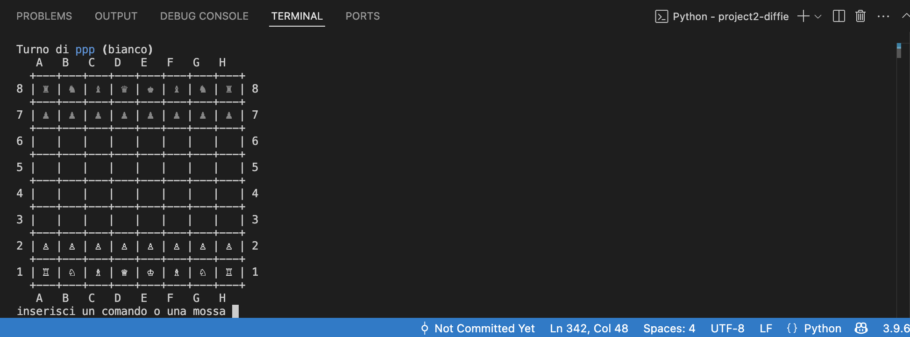

### Muovere un pedone con cattura

#### Prima della cattura
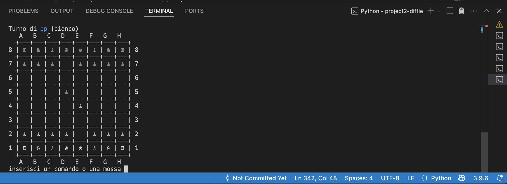

#### Dopo la cattura

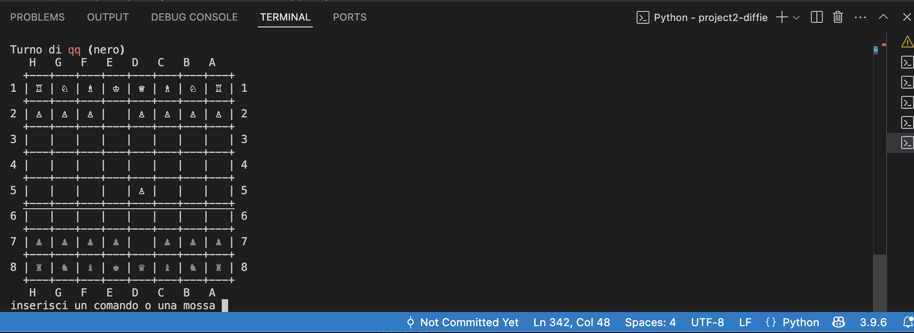

### Muovere la Donna

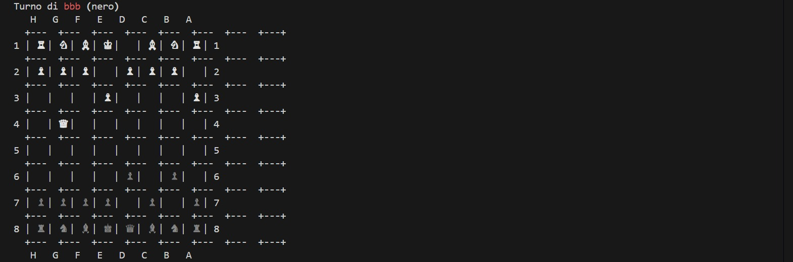

### Muovere la Torre

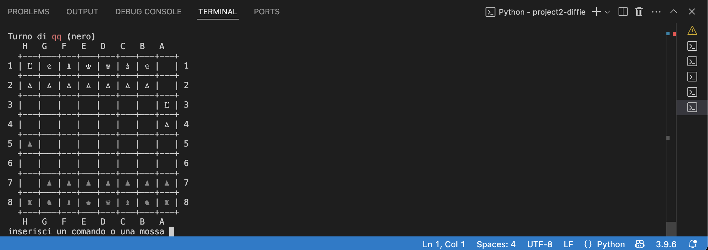

### Muovere l'Alfiere

### Muovere il Cavallo

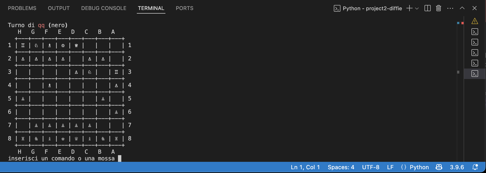

### Muovere un Re senza Arrocco

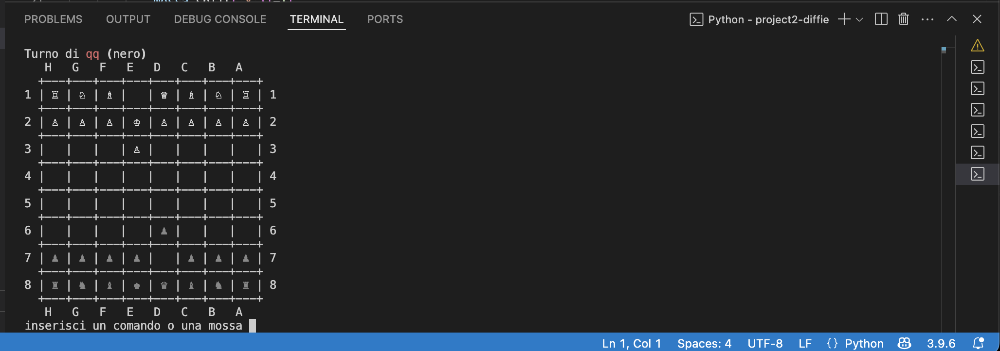

### Giocare un Arrocco

#### Prima dell'Arrocco
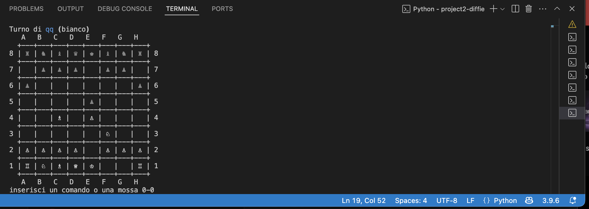

#### Dopo l'Arrocco

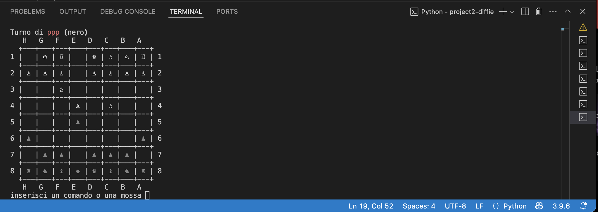

### Promuovere un Pedone

#### Prima della Promozione
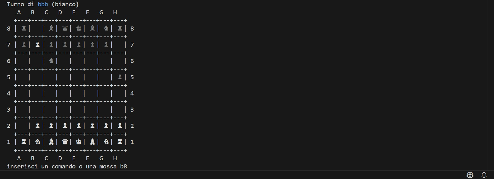

#### Dopo la Promozione

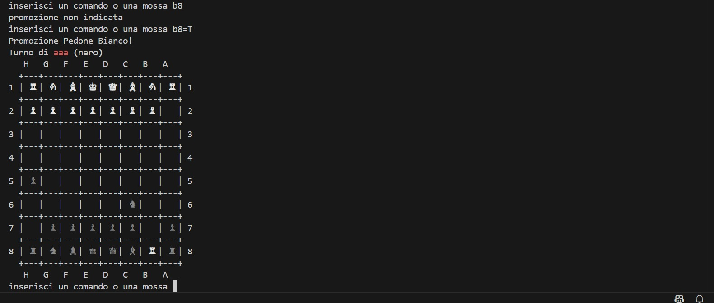

### Mettere un Re sotto scacco

#### Prima dello Scacco
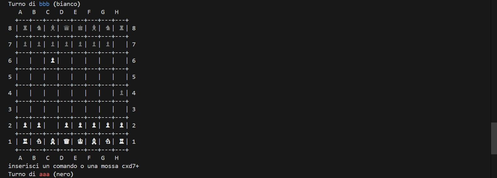

#### Dopo lo Scacco

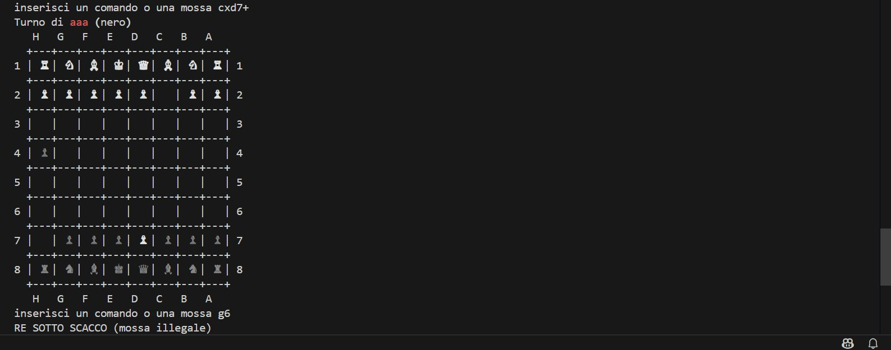

### En Passant

#### Prima dell'En Passant
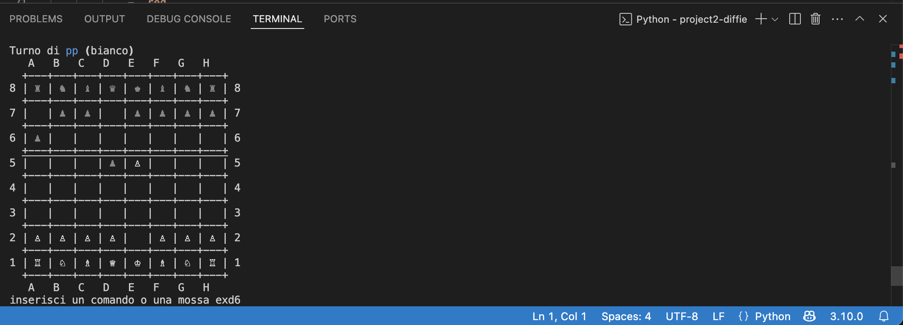

#### Dopo dell'En Passant

### Patta

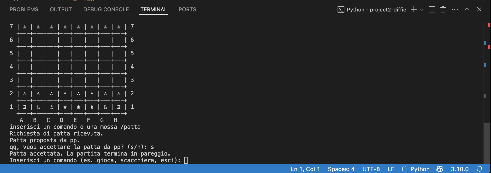

### Abbandona

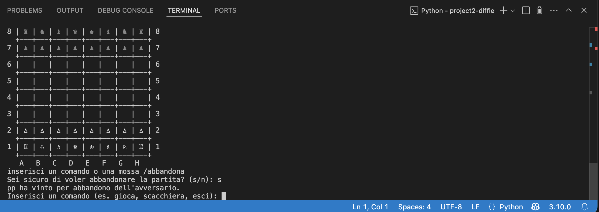

### Esci

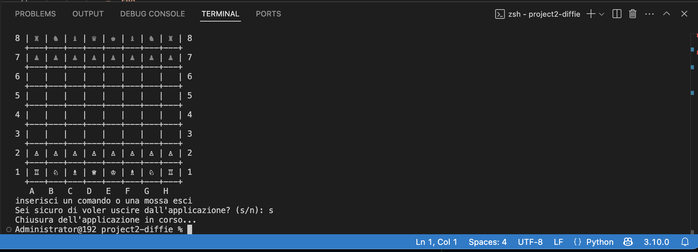

### Mosse

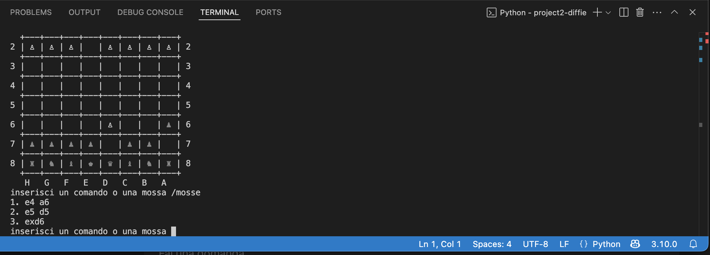