# Report
# Indice

- ### [# 1 - Introduzione](#1---introduzione)
  - [**Partecipanti al progetto**](#partecipanti-al-progetto)
  - [**Descrizione progetto**](#descrizione-progetto)
- ### [# 2 - Modello di Dominio](#2---modello-di-dominio)
- ### [# 3 - Requisiti Specifici](#3---requisiti-specifici)
  - [**3.1 - Requisiti Sprint 1**](#31---requisiti-sprint-1)
  - [**3.1.2 - Requisiti Sprint 2**](#312---requisiti-sprint-2)
    - [**3.1.1 - Funzionali**](#311---funzionali)
    - [**3.2 - Non Funzionali**](#32---non-funzionali)
- ### [# 4 - System Design](#4---system-design)
  - [**4.1 - Diagramma dei Pacchetti**](#41---diagramma-dei-pacchetti)
  - [**4.2 Architettura dell'Applicazione**](#42-architettura-dellapplicazione)

- ### [# 5 - Object Oriented Design](#51---diagrammi-di-classi-e-sequenza)
- ### [# 6 - Testing](#-6---testing)
  - [**6.1 - Strategia di Testing**](#61---strategia-di-testing)
  - [**6.2 - Struttura dei Test**](#62---struttura-dei-test)
  - [**6.3 - Presentazione dei Casi di Test**](#63---presentazione-dei-casi-di-test)

- ### [# 7 - Processo di Sviluppo e Organizzazione del lavoro](#7---processo-di-sviluppo-e-organizzazione-del-lavoro)
  - [**7.1 - Introduzione al processo di sviluppo**](#71---introduzione-al-processo-di-sviluppo)
  - [**7.2 - Recap Sprint**](#72---recap-sprint)
  - [**7.3 - Gestione degli Sprint**](#73---gestione-degli-sprint)
  - [**7.4 - Software utilizzati**](#74---software-utilizzati)
  - [**7.5 - Comunicazione interna**](#75---comunicazione-interna)
- ### [# 8 - Analisi Retrospettiva](#8---analisi-retrospettiva)
  - [**8.1 - Sprint 0**](#81---sprint-0)
  - [**8.2 - Sprint 1**](#82---sprint-1)

  # 1 - Introduzione

## Partecipanti al progetto

Il team di sviluppatori è composto da:
+ **Giovanni Vendola ([Giovanni0910](https://github.com/Giovanni0910))**
+ **Mirko Patruno ([mirkopat3](https://github.com/mirkopat3))**
+ **Antonio Zingarelli ([AntoZinga14](https://github.com/AntoZinga14))**
+ **Lucino Sanchioni ([Luisan-55](https://github.com/Luisan-55))**

#### [Ritorna all'Indice](#indice) 👻

## Descrizione progetto

Di seguito viene riportata la documentazione riguardante il progetto di "Ingegneria del Software" anno 2024/25 del gruppo **Diffie** che implementa il gioco **Scacchi**.


Il progetto consiste nella realizzazione del videogioco scacchi giocabile attraverso linea di comando.

<p align="center">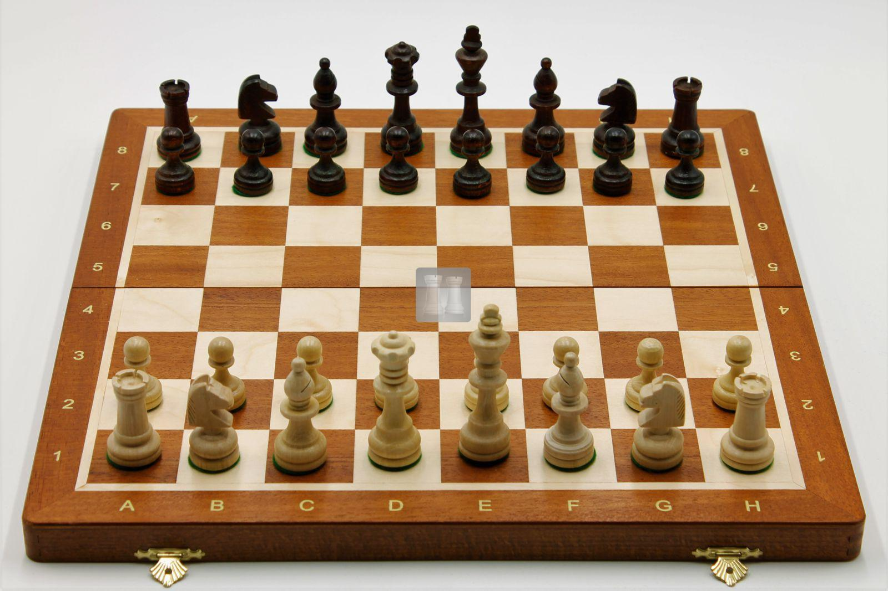</p>

L'implementazione offre solo la possibilità di effettuare una partita, assieme ad un altro giocatore, dalla stessa macchina. All'avvio del gioco verrà stampata la scacchiera(8 x 8) e da lì inizierà la partita. 

#### [Ritorna all'Indice](#indice) 👻

# 2 - Modello di Dominio
- Il seguente diagramma rappresenta il modello di dominio dell'applicazione scacchi, realizzata utilizzando il web software [Drawio](https://app.diagrams.net/)
  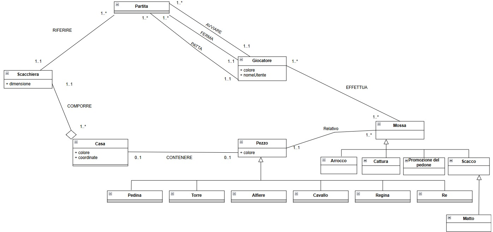


  #### [Ritorna all'Indice](#indice) 👻

# 3 - Requisiti Specifici
Di seguito vengono riportati i requisiti funzionali e non funzionali del progetto con stile di descrizione di tipo user story.
## 3.1 - Requisiti Sprint 1:
**Obiettivo: piccoli comandi**
### 3.1.1 - Funzionali

- **RF1**: Come giocatore voglio mostrare l'help con elenco comandi

  #### Criteri di accettazione

  Al comando `/help` o invocando l'app con flag `--help` o `-h` il risultato è una descrizione concisa, che normalmente appare all'avvio del programma, seguita dalla lista di comandi disponibili, uno per riga, come da esempio successivo:
  - gioca
  - esci
  - ...
- **RF2**: Come giocatore voglio iniziare una nuova partita

  #### Criteri di accettazione

Al comando `/gioca` se nessuna partita è in corso l'app mostra la scacchiera con i pezzi in posizione iniziale e si predispone a ricevere  la prima mossa di gioco del bianco o altri comandi.
Esempio di output:
```bash
|   | a | b | c | d | e | f | g | h |
|---|---|---|---|---|---|---|---|---|
| 8 | ♜ | ♞ | ♝ | ♛ | ♚ | ♝ | ♞ | ♜ |
| 7 | ♟ | ♟ | ♟ | ♟ | ♟ | ♟ | ♟ | ♟ |
| 6 |   |   |   |   |   |   |   |   |
| 5 |   |   |   |   |   |   |   |   |
| 4 |   |   |   |   |   |   |   |   |
| 3 |   |   |   |   |   |   |   |   |
| 2 | ♙ | ♙ | ♙ | ♙ | ♙ | ♙ | ♙ | ♙ |
| 1 | ♖ | ♘ | ♗ | ♕ | ♔ | ♗ | ♘ | ♖ |
```

- **RF3**: Come giocatore voglio mostrare  la scahcchiera con i pezzi 

  #### Criteri di accettazione
  Al comando `/scacchiera`:
  - se il gioco non è iniziato l'app suggerisce il comando `/gioca`
  -	se il gioco è iniziato l'app mostra la posizione di tutti pezzi sulla scacchiera

- **RF4**: Come giocatore voglio proporre la patta 
L'applicazione chiede **conferma** all’avversario
            - se l’avversario **accetta**, la partita termina con il pareggio
            - se l’avversario **rifiuta**, l'app si predispone a _ricevere nuovi tentativi_ o _comandi_

 #### Criteri di accettazione

- **RF5**: Come giocatore voglio muovere un pedone

#### Criteri di accettazione:
- l'app deve accettare **mosse in [notazione algebrica abbreviata](https://it.wikipedia.org/wiki/Notazione_algebrica)** in italiano
- la mossa deve **rispettare le regole degli scacchi ma senza cattura**: “I pedoni hanno la particolarità di muoversi e di catturare in due modi diversi: si muovono in avanti, ~~ma catturano in diagonale~~. I pedoni possono solo avanzare di una e di una sola casa per volta. Quando un pedone si muove per la prima volta può però avanzare anche di due case. ~~I pedoni catturano solo sulle case poste immediatamente davanti a loro, in diagonale~~. Non possono mai indietreggiare, né catturare all'indietro. Se un altro pezzo è collocato direttamente davanti al pedone, quest'ultimo non può né superarlo, né catturarlo.”
- ~~il pedone può catturare _en passant_~~
 - se si tenta una mossa **non valida** l’app mostra un _messaggio di errore_ e rimane in _attesa di una mossa valida_
- se la mossa è **valida** l'app mostra la _posizione di tutti pezzi sulla scacchiera_ a **mossa avvenuta**.

- **RF6**: Come giocatore voglio abbandonare la partita

  #### Criteri di accettazione
  Al comando `/abbandona` l'applicazione chiede conferma dell'azione:
  - se la conferma è positiva, l'app comunica che il Bianco (_o Nero_) ha vinto per abbandono e dichiara come vincitore l’avversario
  - se la conferma è negativa, l'app si predispone a ricevere nuovi tentativi o comandi.

- **RF7**: Come giocatore voglio chiudere il gioco

  #### Criteri di accettazione
  Al comando `/esci` l'applicazione chiede **conferma**:
  - se la conferma è **positiva**, l'app si chiude restituendo il controllo al sistema operativo;
  - se la conferma è **negativa**, l'app si predispone a ricevere nuovi tentativi o comandi.

  **RF8**: Come giocatore voglio voglio mostrare le mosse giocate
  #### Criteri di accettazione
   Al comando `/mosse` l'applicazione mostra:

  #### Criteri di accettazione
  L'app mostra la **storia delle mosse** con [notazione algebrica](https://it.wikipedia.org/wiki/Notazione_algebrica) abbreviata in italiano

 Esempio:   
1. `e4 c6`
2. `d4 d5`
3. `Cc3 dxe4`
4. `Cxe4 Cd7`
5. `De2 Cgf6`

## 3.1.2 - Requisiti Sprint 2:
- *RF9*: Come giocatore voglio Muovere un pedone con cattura

  #### Criteri di accettazione:
  - l'app deve accettare **mosse in [notazione algebrica abbreviata](https://it.wikipedia.org/wiki/Notazione_algebrica)** in italiano
  - la mossa deve rispettare le regole degli scacchi 
  - il pedone può catturare pezzi, anche en passant 
      - I pedoni hanno la particolarità di muoversi e di catturare in due modi diversi: si muovono in avanti, ma     catturano in diagonale. I pedoni possono solo avanzare e di una sola casa per volta. Quando un pedone si muove per la prima volta può però avanzare anche di due case. I pedoni catturano solo sulle case poste immediatamente davanti a loro, in diagonale. Non possono mai indietreggiare, né catturare all'indietro. Se un altro pezzo è collocato direttamente davanti al pedone, quest'ultimo non può né superarlo, né catturarlo. 
  - se si tenta una mossa non valida è mostrato il messaggio "mossa illegale" e l'applicazione rimane in attesa di una mossa valida 

- *RF10*: Come giocatore voglio Muovere la Donna

  #### Criteri di accettazione:
  - l'app deve accettare **mosse in [notazione algebrica abbreviata](https://it.wikipedia.org/wiki/Notazione_algebrica)** in italiano
  - la mossa deve rispettare le regole degli scacchi 
  - la Donna può catturare pezzi 
  - se si tenta una mossa non valida è mostrato il messaggio "mossa illegale" e l'applicazione rimane in attesa di una mossa valida 

- *RF11*: Come giocatore voglio Muovere una Torre

  #### Criteri di accettazione:
  - l'app deve accettare **mosse in [notazione algebrica abbreviata](https://it.wikipedia.org/wiki/Notazione_algebrica)** in italiano
  - la mossa deve rispettare le regole degli scacchi 
  - la Torre può catturare pezzi 
  - se si tenta una mossa non valida è mostrato il messaggio "mossa illegale" e l'applicazione rimane in attesa di una mossa valida 

- *RF12*: Come giocatore voglio Muovere un Alfiere

  #### Criteri di accettazione:
  - l'app deve accettare **mosse in [notazione algebrica abbreviata](https://it.wikipedia.org/wiki/Notazione_algebrica)** in italiano
  - la mossa deve rispettare le regole degli scacchi 
  - l' Alfiere può catturare pezzi 
  - se si tenta una mossa non valida è mostrato il messaggio "mossa illegale" e l'applicazione rimane in attesa di una mossa valida 

- *RF13*: Come giocatore voglio Muovere un Cavallo

  #### Criteri di accettazione:
  - l'app deve accettare **mosse in [notazione algebrica abbreviata](https://it.wikipedia.org/wiki/Notazione_algebrica)** in italiano
  - la mossa deve rispettare le regole degli scacchi 
  - il Cavallo può catturare pezzi 
  - se si tenta una mossa non valida è mostrato il messaggio "mossa illegale" e l'applicazione rimane in attesa di una mossa valida 

- *RF14*: Come giocatore voglio Muovere il Re senza arrocco 

  #### Criteri di accettazione:
  - l'app deve accettare **mosse in [notazione algebrica abbreviata](https://it.wikipedia.org/wiki/Notazione_algebrica)** in italiano
  - la mossa deve rispettare le regole degli scacchi 
    - il Re non può muoversi in case minacciate da pezzi avversari 
    - il Re può catturare pezzi 
  - se si tenta una mossa non valida è mostrato il messaggio "mossa illegale" e l'applicazione rimane in attesa di una mossa valida 

- *RF15*: Come giocatore voglio Giocare un arrocco 

  #### Criteri di accettazione:
  - la mossa deve rispettare le regole degli scacchi 
    - Una sola volta in tutta la partita ciascun re può usufruire di una mossa speciale, nota come arrocco, che consiste nel muovere il re di due case in direzione della torre lato re (arrocco corto) o della torre lato donna (arrocco lungo) e successivamente, sempre durante lo stesso turno, muovere la torre verso la quale il re si è mosso nella casa compresa tra quelle di partenza e di arrivo del re. Questo si può fare solamente se tutte le condizioni seguenti sono soddisfatte: 
          - Il giocatore non ha ancora mosso né il re né la torre coinvolta nell'arrocco; 
          - Non ci devono essere pezzi (amici o avversari) fra il re e la torre utilizzata; 
          - Né la casa di partenza del re, né la casa che esso deve attraversare, né quella di arrivo devono essere minacciate da un pezzo avversario. 
  - l'app deve accettare **mosse in [notazione algebrica abbreviata](https://it.wikipedia.org/wiki/Notazione_algebrica)** in italiano
      - L'arrocco corto viene indicato con 0-0 
      - L'arrocco lungo viene indicato con 0-0-0 

- *RF16*: Come giocatore voglio Promuovere un pedone 

  #### Criteri di accettazione:
  - l'app deve accettare **mosse in [notazione algebrica abbreviata](https://it.wikipedia.org/wiki/Notazione_algebrica)** in italiano
  - la mossa deve rispettare le regole degli scacchi 
    - Se un pedone riesce ad avanzare fino all'ottava traversa, viene promosso, ossia assume il ruolo e le capacità di movimento di un altro pezzo dello stesso colore (donna, torre, alfiere o cavallo) a scelta del giocatore, indipendentemente dai pezzi già presenti sulla scacchiera. In questo modo è dunque possibile avere un numero di esemplari di un certo pezzo maggiore rispetto a quello iniziale. 

- *RF17*: Come giocatore voglio Mettere un re sotto scacco

  #### Criteri di accettazione:
  - l'app deve accettare **mosse in [notazione algebrica abbreviata](https://it.wikipedia.org/wiki/Notazione_algebrica)** in italiano
  - la mossa deve rispettare le regole degli scacchi 
    - Il re è l'unico pezzo che non può mai essere catturato, ma solo minacciato. Quando un re è minacciato, trovandosi sulla traiettoria di un pezzo nemico, si dice che è "sotto scacco"; non è consentita alcuna mossa che ponga o lasci il proprio re in tale condizione.  
    - Per eliminare la minaccia si deve procedere in uno dei seguenti modi: 
        - muovere il re in una delle case adiacenti, a patto che questa non sia sotto il controllo di un pezzo avversario; 
        - catturare, con il re o con un altro pezzo, il pezzo avversario che si trova sulla traiettoria del re e dà origine allo scacco; 
        - nel caso di minaccia da parte di donna, torre o alfiere non adiacenti al re sotto attacco, frapporre tra quest'ultimo e il pezzo che minaccia scacco un qualunque pezzo o pedone, in modo che sia quest'ultimo a essere minacciato invece del re. 
    - Se nessuna delle mosse che il giocatore può effettuare è in grado di liberare il re dallo scacco, si tratta di scacco matto e la partita termina con la vittoria dell'avversario.  
    - Se invece il re non si trova sotto scacco ma non è possibile effettuare alcuna mossa legale (ad esempio se si ha solo il re in gioco ed esso non è sotto scacco ma tutte le case ad esso adiacenti sono minacciate), si tratta di stallo e la partita termina con un risultato di parità, non potendo il giocatore che si trova in questa condizione muovere senza contravvenire alle regole del gioco. 
  


  #### [Ritorna all'Indice](#indice) 👻

### 3.2 - Non Funzionali
- **RNF1**: Il container docker dell'app deve essere eseguito da terminali che supportano Unicode con encoding UTF-8 o UTF-16. A seguito un elenco di terminali adeguati divisi per sistema operativo:
  - **Linux:** terminal;
  - **Windows:** Powershell, Git Bash;
  - **MacOS** 

  - I simboli **UTF-8** per i pezzi degli scacchi sono: ♔ ♕ ♖ ♗ ♘ ♙ ♚ ♛ ♜ ♝ ♞ ♟.

#### [Ritorna all'Indice](#indice) 👻

# 4 - System Design

## 4.1 - Diagramma dei Pacchetti
Il seguente diagramma rappresenta la struttura dei pacchetti utilizzati per implementare il progetto, realizzato utilizzando il software [*Draw.io*](https://www.drawio.com/)
<p align="center">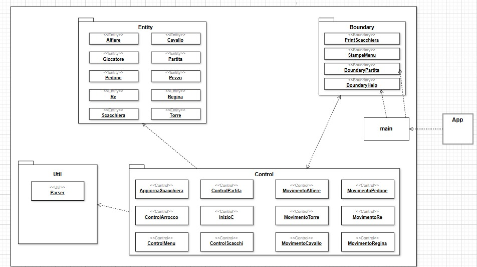</p>

## 4.2 Architettura dell'Applicazione

#### Principi Rispettati
Separazione delle Responsabilità (ECB Pattern)

Il sistema è ben strutturato secondo il pattern Entity-Control-Boundary.

Le entità (Alfiere, Giocatore, Pedone, etc.) rappresentano i concetti chiave del dominio.
I boundary (PrintScacchiera, StampeMenu, etc.) gestiscono l'interazione con l'esterno.
I control (AggiornaScacchiera, ControlPartita, etc.) gestiscono la logica applicativa.

#### Principio di Singola Responsabilità

Ogni componente ha una responsabilità ben definita (es. MovimentoTorre si occupa solo dei movimenti della torre).

Le classi di controllo sono specializzate per specifiche funzionalità.

#### Basso Accoppiamento

La struttura ECB impone limiti chiari sulle interazioni tra componenti.

Le boundary sono l'unico punto di contatto con l'esterno, mentre le entity comunicano principalmente con i control.

#### Information Hiding

Le entità incapsulano i dati del dominio

I dettagli implementativi sono nascosti dietro le interfacce dei boundary.

#### Open/Closed Principle

Il sistema è estendibile (es. si possono aggiungere nuovi pezzi come entità senza modificare quelli esistenti).

I movimenti dei pezzi sono implementati in classi separate, quindi aggiungere un nuovo tipo di movimento non richiederebbe modifiche alle classi esistenti.
#### [Ritorna all'Indice](#indice) 👻


# 5 - Object Oriented Design

## 5.1 - Diagrammi di Classi e Sequenza


In questo paragrafo vengono riportati i diagrammi UML delle classi e di sequenza relativi alle ***User Story*** più significative
### NOTA IMPORTANTE: 
Ciò che viene rappresentato nei seguenti diagrammi non è la mappatura 1:1 delle classi nel codice, infatti le classi
potrebbero risultare incoerenti le loro versioni in diagrammi diversi, questo perché in ogni diagramma vengono riportati
gli attributi e metodi rilevanti per la user story. Inoltre anche alcuni nomi di variabili o metodo sono stati semplificati , a causa della loro lunghezza. Inoltre per rendere diagramma leggibile e comprensibile il più possibile è stato deciso di non scedere troppo nei dettagli implementativi, cercando sempre di far comprendere il flusso di controllo relativo a quella user story. Inoltre abbiamo deciso anche di accorpare alcune user story , fornendo un unico diagramma , poichè i diagrammi sarebbe stati uguali (a meno di piccolezze). 


- **[RF2](https://github.com/softeng2425-inf-uniba/project2-diffie/issues/23):** Come giocatore voglio iniziare una nuova partita
  <br></br>
  - **Diagramma delle Classi**
  <p align="center">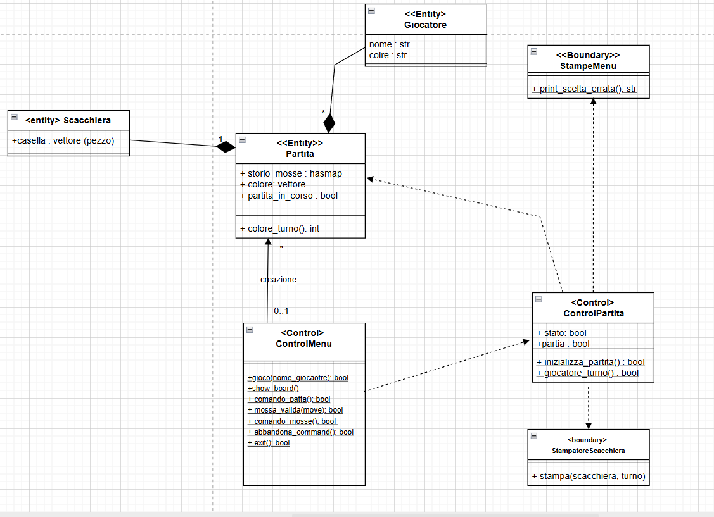</p>
  <br></br>

  - **Diagramma di Sequenza**
    <p align="center">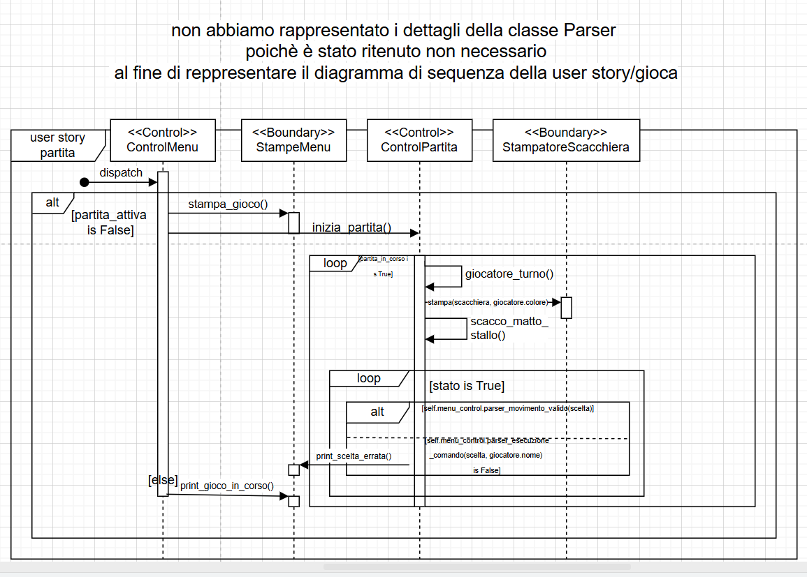</p>
        <br></br>

- **[RF4](https://github.com/softeng2425-inf-uniba/project2-diffie/issues/26)** -**[RF5](https://github.com/softeng2425-inf-uniba/project2-diffie/issues/25)**
 
Come giocatore voglio proporre una patta 
come giocatore voglio abbandonare la partita
  <br></br>
  - **Diagramma delle Classi**
  <p align="center">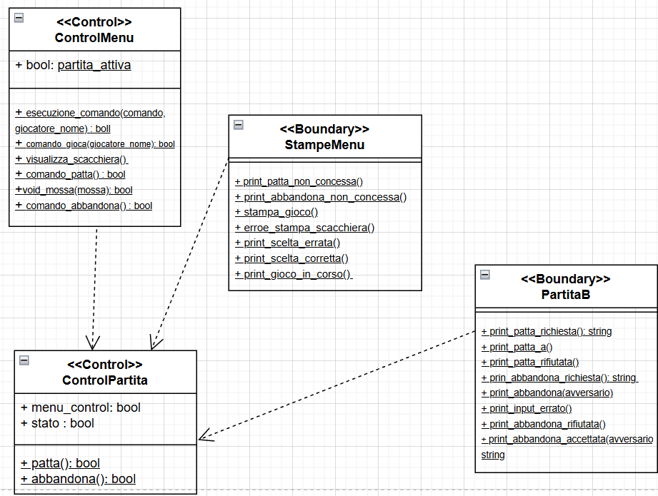</p>
  <br></br>

  - **Diagramma di Sequenza**
    <p align="center">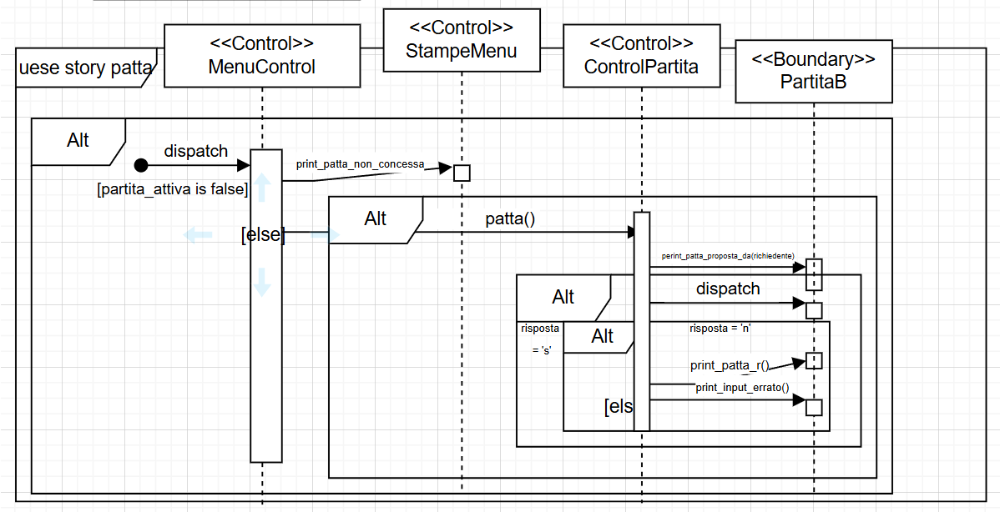</p>
        <br></br>
### Nota
Abbiamo deciso di rappresentare il  due requisito funzionale con un unico diagramma di sequenza e diagramma delle classi, poichè il loro funzionamento era molto simile , quini con tale livello di astrazze , non si sarebbero notate differenze rilevanti. 


- **[RF9](https://github.com/softeng2425-inf-uniba/project2-diffie/issues/66):** Come giocatore voglio muovere un pedone con cattura
- **Diagramma delle Classi**
  <p align="center">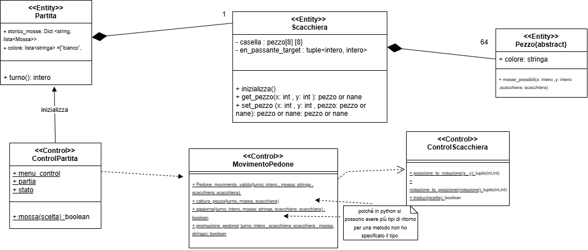</p>
  <br></br>

   - **Diagramma di Sequenza**
    <p align="center"></p>
        <br></br>
    <p align="center"></p>
        <br></br>
    <p align="center"></p>
        <br></br>
    <p align="center"></p>  


- **[RF10](https://github.com/softeng2425-inf-uniba/project2-diffie/issues/67)** -**[RF11](https://github.com/softeng2425-inf-uniba/project2-diffie/issues/68)** -**[RF12](https://github.com/softeng2425-inf-uniba/project2-diffie/issues/69):** 
- Come giocatore voglio muovere un Donna
- Come giocatore vogio muovere una Torre
- Come giocatore voglio muovere un Alfiere 
- **Diagramma delle Classi**
  <p align="center">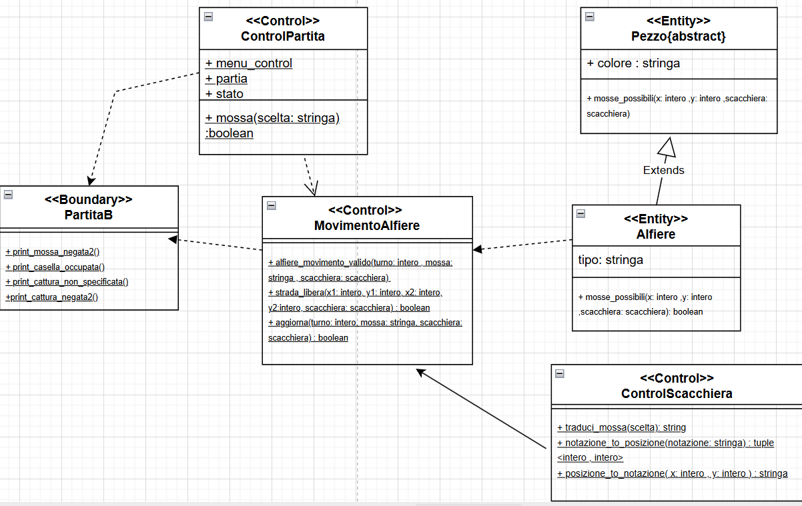</p>
  <br></br>

  - **Diagramma di Sequenza**
    <p align="center">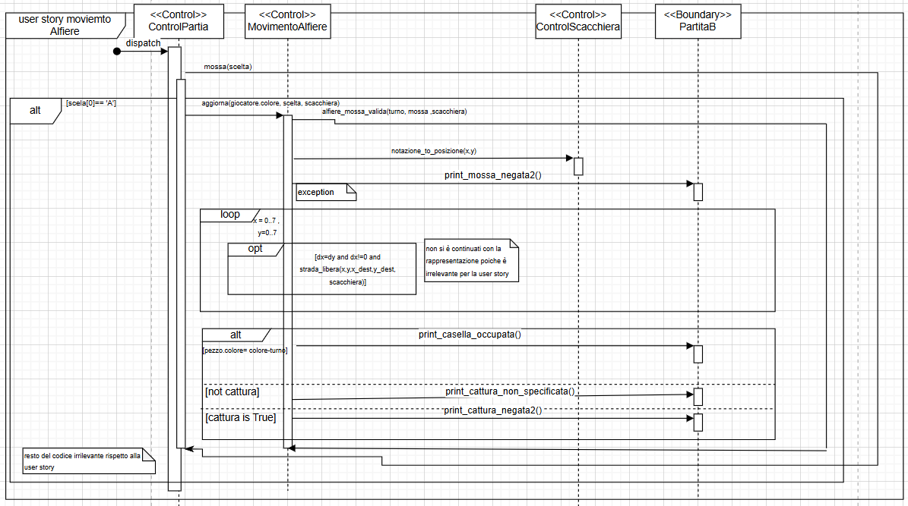</p>
        <br></br>

### Nota 
Come citato nella sezione **Nota Importnate** è stato deciso di rappresentere solo l'alfiere,  poichè il suo funzionamento è analogo alle altre due User Story citate. 

**[RF13](https://github.com/softeng2425-inf-uniba/project2-diffie/issues/70):** Come giocatore voglio muovere un cavallo 
- **Diagramma delle Classi**
  <p align="center">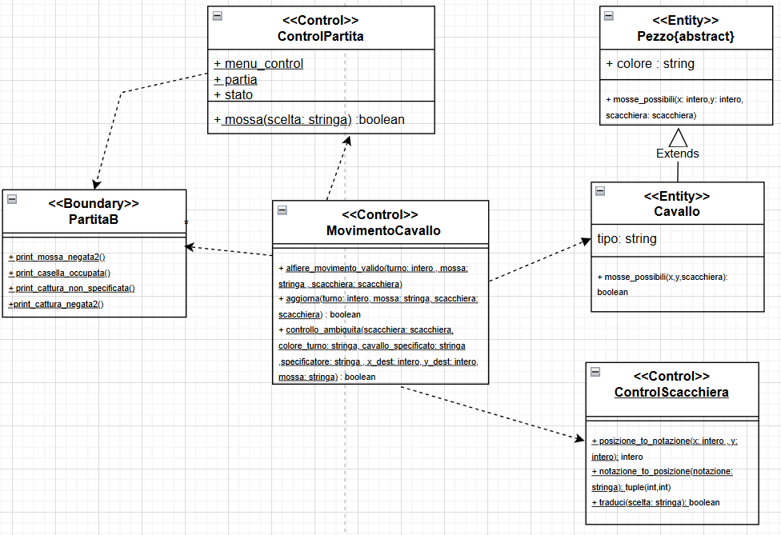</p>
  <br></br>

  - **Diagramma di Sequenza**
    <p align="center">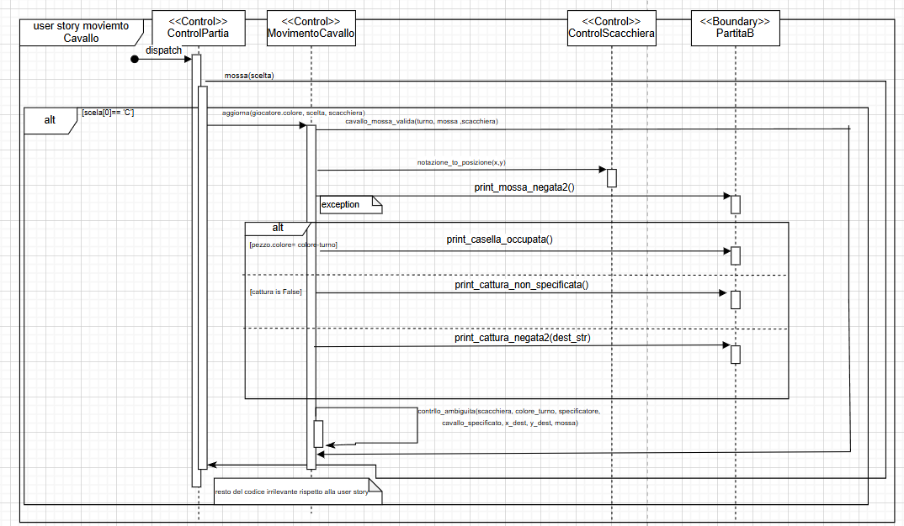</p>
        <br></br>

**[RF14](https://github.com/softeng2425-inf-uniba/project2-diffie/issues/71):** Come giocatore voglio muovere un re senza arrocco 

- **Diagramma delle Classi**
  <p align="center">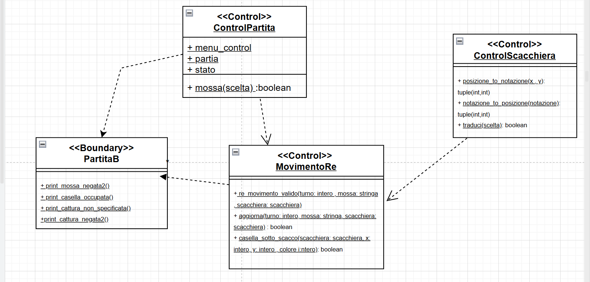</p>
  <br></br>

  - **Diagramma di Sequenza**
    <p align="center">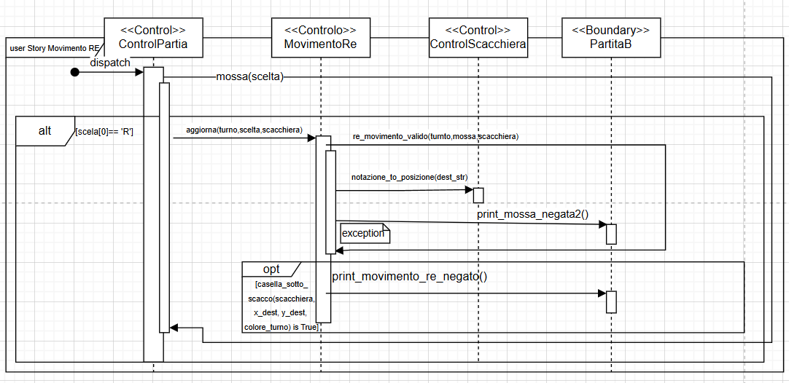</p>
        <br></br>


**[RF15](https://github.com/softeng2425-inf-uniba/project2-diffie/issues/72):** Come giocatore voglio 
giocare un arrocco
- **Diagramma delle Classi**
  <p align="center"></p>
  <br></br>

  - **Diagramma di Sequenza**
    <p align="center"></p>
        <br></br>
    <p align="center"></p>
        <br></br>


**[RF16](https://github.com/softeng2425-inf-uniba/project2-diffie/issues/66):** Come giocatore voglio promuovere un pedone 
- **Diagramma delle Classi**
  <p align="center"></p>
  <br></br>

  - **Diagramma di Sequenza**
    <p align="center">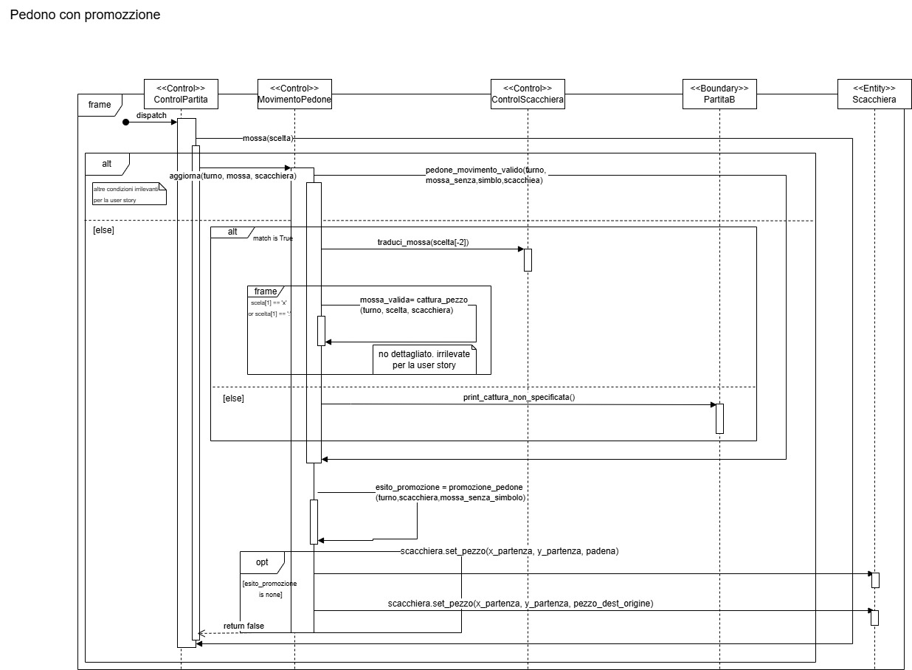</p>
        <br></br>

 ## Nota
Abbiamo deciso di non andare troppo nel dettaglio (come già detto **Nota Importante**) poichè il suo funzionamento è simile al requisito funzionale - **[RF9](https://github.com/softeng2425-inf-uniba/project2-diffie/issues/66)**. 

**[RF17](https://github.com/softeng2425-inf-uniba/project2-diffie/issues/66):** Come giocatore voglio mettere un re sotto scacco

- **Diagramma delle Classi**
  <p align="center">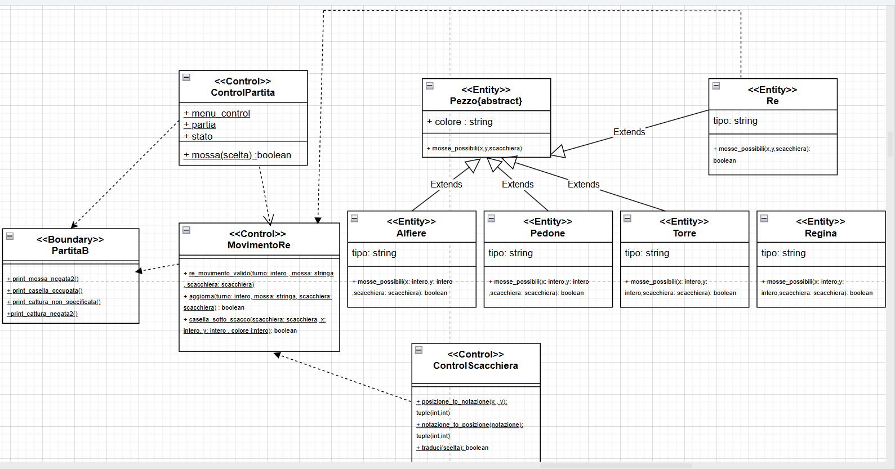</p>
  <br></br>

  - **Diagramma di Sequenza**
    <p align="center"></p>
        <br></br>
    <p align="center"></p>
        <br></br>
    <p align="center"></p>
        <br></br>
    <p align="center"></p>
        <br></br>
# 6 - Testing

#### 6.1 - Strategia di Testing

La suite di test è stata strutturata seguendo le convenzioni standard, creando una classe di test per ogni classe del software, ad eccezione delle classi Boundary. Tutti i test sono stati organizzati in una directory dedicata chiamata "tests", separata dal codice applicativo. La struttura interna della directory dei test riflette fedelmente quella del progetto principale, mantenendo la stessa suddivisione dei moduli. Inoltre, ogni classe di test inizia con il suffisso Test, per facilitarne l’identificazione.

I casi di test sono stati progettati utilizzando criteri funzionali di tipo black-box, ossia facendo riferimento unicamente alle specifiche del sistema, senza tener conto dell’implementazione interna. In particolare, sono stati seguiti i seguenti approcci:

- **Classi di equivalenza**: sono stati selezionati input rappresentativi per ciascun insieme di valori trattati in modo analogo dal sistema, garantendo così una buona copertura del dominio d’ingresso.

- **State-based testing**: si è tenuto conto degli stati in cui può trovarsi il sistema, prima e dopo l’esecuzione di una determinata operazione, al fine di verificare il corretto funzionamento in ogni possibile transizione. Alcuni test sono stati rieseguiti con parametri o oggetti diversi per ampliare la copertura.

Come criterio di conclusione delle attività di testing, è stato adottato il raggiungimento di una copertura quasi completa delle classi di equivalenza.

**Criteri principali utilizzati:**
- **Classi di equivalenza**: Suddivisione degli input in categorie valide/non valide
- **Analisi dei valori limite**: Test dei valori agli estremi degli intervalli
- **Copertura dei branch**: Verifica di buona parte dei percorsi condizionali
- **Mutation testing**: Iniezione di errori per valutare l'efficacia dei test

**Strumenti:**
- Framework: [pytest](https://pypi.org/project/pytest/)
- CI/CD: Integrazione con GitHub Actions

#### [Ritorna all'Indice](#indice) 👻

#### 6.2 - Struttura dei Test

I test sono organizzati in 2 livelli principali:
- **TestControl**: si verifica principalmente il corretto funzionamento e gestione della partita per quanto riguarda lo scacco, lo stallo ed il comando dell'arrocco
- **TestMovimento**: si controllano casi generali e casi limite di tutti i movimenti dei pezzi, coprendo una buona percentuale di casistiche

#### [Ritorna all'Indice](#indice) 👻

#### 6.3 - Presentazione dei casi di test

**Statistiche principali:**
- **Totale test**: **179** (150 TestMovimento, 29 TestControl)
- **Numero di casi di test per ogni modulo**:
  - TestMovimentoRe (24 test)
  - TestMovimentoRegina (31 test)
  - TestMovimentoTorre (27 test)
  - TestMovimentoCavallo (26 test)
  - TestMovimentoAlfiere (21 test)
  - TestMovimentoPedone (21 test)
  - TestControlArrocco (23 test)
  - TestControlPartita (6 test)

#### [Ritorna all'Indice](#indice) 👻

# 7 - Processo di Sviluppo e Organizzazione del lavoro
## 7.1 - Introduzione al processo di sviluppo

Durante l'intero ciclo di sviluppo del progetto, il team ha adottato la metodologia [
***Agile***](https://agilemanifesto.org/iso/it/manifesto.html), un approccio iterativo e incrementale che pone al centro la flessibilità e la collaborazione. Questo framework ha permesso di iniziare con un'accurata analisi dei requisiti, seguita da continui raffinamenti e evoluzioni del prodotto software, realizzati attraverso il lavoro sinergico dei membri del gruppo.

In linea con i valori fondamentali dell'Agile, il team ha organizzato e distribuito i compiti in modo efficace, garantendo un processo di sviluppo fluido e orientato alla creazione di un prodotto finale solido e affidabile.

Per strutturare il lavoro, è stato scelto un approccio [***ispirato a scrum***](https://www.scrum.org/), una metodologia che prevede iterazioni temporali definite, chiamate Sprint. L'intero sviluppo è stato suddiviso in 3 Sprint, ciascuno della durata di 2 settimane, per garantire una gestione ordinata e misurabile delle attività.

Il professore ha ricoperto il ruolo di Product Owner, guidando il team nella definizione delle priorità. Durante ogni Sprint, sia in aula che attraverso [_Microsoft
Teams_](https://www.microsoft.com/en-us/microsoft-teams/group-chat-software), sono stati comunicati i requisiti sotto forma di **Definition of Done** e **User Story**. Il team ha organizzato il lavoro creando una **Board** dedicata per **ogni Sprint** e, a partire dallo Sprint 1, è stato anche sviluppato un Product Backlog per raccogliere le User Story degli Sprint successivi.

Per gestire i task assegnati ad ogni sprint , è stata utilizzata una Board suddivisa in 5 colonne:

**To Do**: Attività da affrontare;

**In Progress**: Task assegnate e in fase di sviluppo;

**Review**: Lavori completati, in attesa di verifica;

**Ready**: Task revisionate e pronte per l'approvazione;

**Done**: Attività ultimate, validate dai revisori e confermate dal Product Owner.

La Board è stata gestita utilizzando la funzionalità Projects di GitHub. Questa organizzazione è stata introdotta fin dallo Sprint 0 per fornire al team un modello chiaro di suddivisione e monitoraggio dei task. Pur avendo la libertà di adattare il workflow, il team ha ritenuto efficace questa struttura e ha scelto di mantenerla invariata per tutto il progetto.

Per lo sviluppo delle singole issue, è stato implementato il [_Github
Flow_](https://docs.github.com/en/get-started/quickstart/github-flow): ogni task, identificato con un numero progressivo (`es. #n`), è stato associato a un branch dedicato (`issue#n`), creato dal membro incaricato. Una volta completato il lavoro, le modifiche sono state sottoposte a revisione attraverso una Pull Request, dove due revisori hanno discusso eventuali correzioni o miglioramenti. Dopo l'approvazione, il branch è stato unito al ramo principale ed eliminato, mantenendo il repository pulito e organizzato.

**Ogni Sprint** è stato associato a una **Milestone** e a un **Project** specifico: 
- le Milestone contenevano una descrizione degli obiettivi dello Sprint, 
- nelle Project venivano elencate tutte le issue da completare. 
Questo sistema ha permesso di avere una visione chiara e aggiornata dello stato di avanzamento, tracciando facilmente quali attività erano in attesa, in corso, in revisione o pronte per l'approvazione finale.

#### [Ritorna all'Indice](#indice) 👻

## 7.2 - Recap Sprint

- 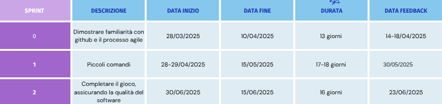


## 7.3 - Gestione degli Sprint
Nel contesto del framework Scrum, ogni Sprint è stato strutturato in quattro fasi fondamentali: analisi, progettazione, implementazione e testing.

Fin dall’inizio, il team ha scelto di puntare sulla collaborazione piuttosto che sulle capacità individuali, promuovendo uno scambio costante di conoscenze e competenze. Per questo motivo, è stato deciso che a ogni Sprint si sarebbe svolto un meeting dedicato all’assegnazione collettiva delle issue, con l’obiettivo di garantire che ogni membro del team svolgesse almeno due attività di revisione e partecipasse ad almeno un’issue condivisa in modo tale da instaurare un rapporto di fiducia con ogni membro del team.

Il team è cosciente che ogni persona ha dei punti forti e dei punti deboli, ma proprio per questo abbiamo deciso di adottare questo approccio,
per poter migliorare le nostre competenze e conoscenze, e per poter lavorare in un ambiente collaborativo e di crescita continua(anche se non sempre è stato rispettato). 

1. ### **Fase di analisi:**

  - Il team si è sempre riunito in un meeting iniziale per discutere e analizzare i requisiti del progetto, in modo da poterli suddividere in issue e assegnarli ai membri del team.

2. ### **Fase di progettazione:**
  - Il team ha utilizzato il framework Scrum per la gestione degli Sprint, il quale ha permesso di suddividere il lavore in maniera equa.  

3. ### **Fase di implementazione:**

  - Il team lavora in maniera sinergica per risolvere gli issues, condividendo le conoscenze e le competenze, per ottenere un prodotto di qualità.

4. ### **Fase di testing:**

  - Per ogni issue completata si esegue un testing per verificare che non ci siano errori e che il codice  rispetti le regole del gioco. 


## Sprint 0

L'obiettivo di questo Sprint era quello di mostrare familiarità con [_Git_](https://git-scm.com/), [_Github_](https://github.com/) e
il processo Agile.
- Per questo Sprint si sono decise tutte le regole di sviluppo e di condotta da seguire per il progetto,   in  modo da garantire un ambiente di lavoro sano e collaborativo. Abbiamo scelto una durata di circa 30m-1h per il daily scrum,in modo da poter discutere i problemi e le soluzioni trovate.


- Nella **fase di analisi** si sono risolti i primi issue, in modo da poter prendere confidenza con il processo di sviluppo e con gli strumenti utilizzati.


- In questo Sprint, i task riguardavano per lo più documentazione in modo da permettere ai componenti del team di prendere confidenza con gli strumenti e i processi senza aggiungere complicazione dovute all'analisi, alla
progettazione e alla stesura di codice. Data quindi la natura delle attività, la **fase di progettazione** non è stata inclusa.

- Durante la ***fase di implementazione,*** ciascun membro ha lavorato alla risoluzione degli issue assegnati, con l’obiettivo di acquisire familiarità con il processo di sviluppo e con gli strumenti utilizzati dal team.

- Nella fase di testing, è stata effettuata una verifica accurata delle issue completate per assicurarsi che non contenessero errori e che il codice rispettasse gli standard e le linee guida stabilite dal team.

## Sprint 1

L'obiettivo di questo Sprint era quello di preparare il gioco.
- Questo sprint è stato dedicato alla realizzazione dei **primi comandi del gioco** con il **movimento** del **pedone**, per poi poter iniziare a sviluppare il gioco vero e proprio.


- Nella **fase di analisi** abbiamo deciso di assegnare a ciascun membro del team almeno una issue di codice, tenendo a mente anche di 
  chi avesse più esperienza a scrivere codice e chi avesse più esperienza a scrivere documentazione. Alcune issue sono state assegnate a più membri del team, sia per un livello di complessità maggiore rispetto alle altre, ma soprattutto per favorire la collaborazione e permettere a chi aveva delle lacune su determinati argomenti di colmarle attraverso il lavoro condiviso. 
  Il team fin da subito ha voluto puntare sulla massima modularità del codice cercando di creare un diagramma di classi con prospettiva concettuale ricco di dettagli.
  Le classi sono state divise in package in modo da poter avere una visione più chiara del codice e per poterlo dividere in maniera più efficiente, avendo come risultato un' implementazione più pulita e ordinata.


- Nella **fase di progettazione** si sono discusse le soluzioni da adottare per risolvere gli issue assegnati, ogni membro (o membri)  che si doveva occupare di quella issue proponeva la soluzione e i restanti membri ponevano domande e critiche,
  in modo da poter migliorare la soluzione proposta.


- Nella **fase di implementazione**  sono state risolte le issue assegnate come descritto nella fase di progettazione.

- Nella **fase di testing** abbiamo verificato che le issue risolte non presentassero errori. 


## Sprint 2

L'obiettivo di questo sprint era quello di completare il gioco, assicurando la qualità del software.

- Nella **fase di analisi** abbiamo deciso di assegnare ad ogni membro (o alla coppia) del team  un issue , come negli sprint precedenti.

- Nella **fase di progettazione** abbiamo discusso come sviluppare il **diagramma dei package**, relativo al System Design, insieme
  ai **diagrammi delle classi** e i **diagrammi di sequenza** delle **user story** principali. Per quanto riguarda la parte di **codice** relativa alle **user story**, il team ha deciso, per questo sprint, di eseguire questa fase in modo diverso, **incontrandosi solo con un membro del team** (e non con tutti) per discutere della soluzione da adottare per risolvere la issue.


- Nella **fase di implementazione** gli issue assegnati sono stati risolti secondo quanto stabilito durante la **fase di progettazione**. Una volta completata la propria **user story**, sfruttando uno dei software di comunicazione interna, **almeno tre quarti del team** si riuniva per fornire un primo **feedback immediato** sul lavoro svolto.


- Nella **fase di testing** si sono verificati che gli issue risolti non presentassero errori, inoltre si è svolto un testing con [Pytest](https://Pytest.org/) per verificare che il gioco fosse conforme ai requisiti richiesti.

#### [Ritorna all'Indice](#indice) 👻

## 7.4 - Software utilizzati

- **Organizzazione e Review del lavoro**
  - [*Microsoft Teams*](https://www.microsoft.com/en-us/microsoft-teams/group-chat-software), in cui venivano definiti i compiti per ogni Sprint;
  - [*Discord*](https://discord.com/), per le riunioni interne al team;
  - [*Whatsapp*](https://www.whatsapp.com/), per organizzare le riunioni sincrone.
- **Ambienti di sviluppo**
  - [*Visual Studio Code*](https://code.visualstudio.com/) l'intero team ha usato un IDE omogeneo , ovvero VSCODE per facilità d'uso e la possibilità di avere tante estensioni. 
  
- **Software per la creazione di diagrammi**
- [*Draw.io*](https://www.drawio.com/), dato il precedente utilizzo di alcuni membri del team.

## 7.5 - Comunicazione interna 
In questa foto si può notare l'organizzazione del team a uno dei meeting 
- 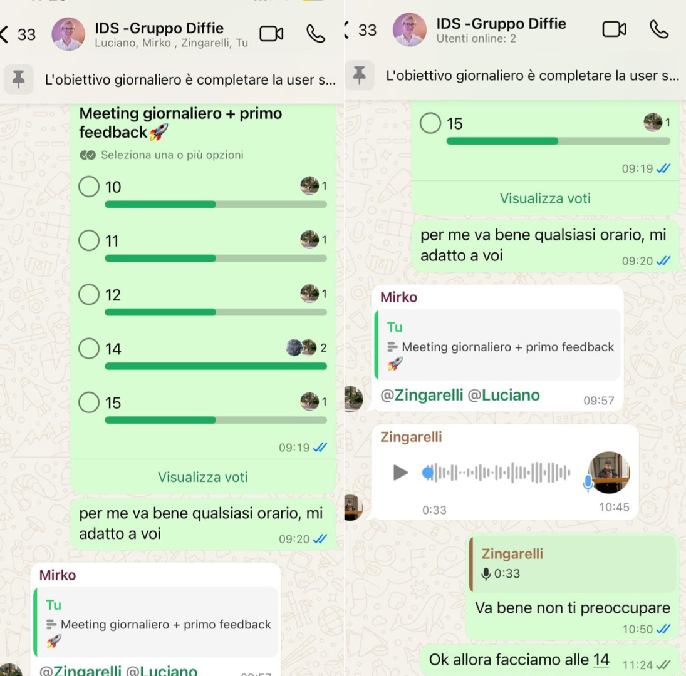

In questa foto è possibile vedere come Discord sia stato utile per lo svolgimento del lavoro, grazie alla possibilità di condividere il proprio schermo.
- 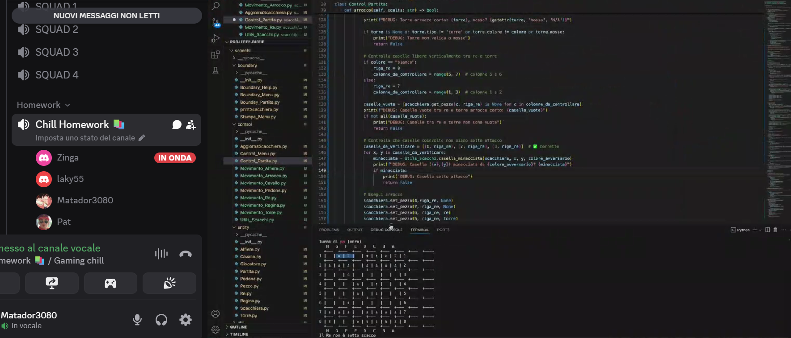

#### [Ritorna all'Indice](#indice) 👻

# 8 - Analisi Retrospettiva

- In questa sezione andremo ad analizzare i nostri comportamenti durante lo sviluppo del software
  ed il rispetto delle regole di sviluppo imposte dal team, dal codice di condotta e dal manifesto dello sviluppo agile.
  Si riporteranno i punti forza e debolezza emersi durante lo sviluppo del progetto tramite tabelle ed infine
  verranno suggeriti i miglioramenti proposti per evitare errori simili in futuro.

## 8.1 - Sprint 0
  L'analisi retrospettiva è iniziata con la creazione della lavagna per raccogliere le sensazioni e le emozioni del team dopo aver chiuso lo Sprint 0.

  Di seguito riportiamo la tabella creata:

  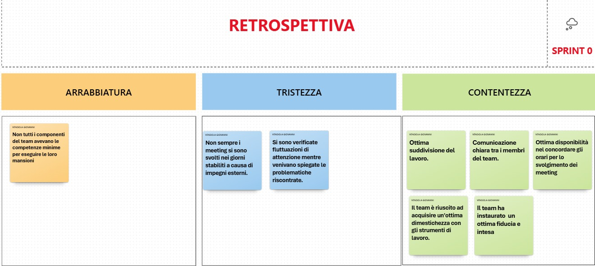

  Dalla tabella si evince che:
  <ul>
      <li>Il team è contento di:
          <ul>
              <li>Essere riuscito ad organizzarsi al meglio</li>
              <li>Aver diviso equamente il lavoro assegnato</li>
              <li>Esser riusciti s coordinarci anche attraverso meeting a distanza</li>
          </ul>
      </li>
      <li>Il team è triste per:
          <ul>
              <li>Non essere riusciti sempre a incontrarsi nei giorni prestabiliti</li>
              <li>Fluttuazioni di attenzione durante le spiegazioni delle problematiche riscontrate</li>
          </ul>
      </li>
      <li>Il team è arrabbiato per:
          <ul>
              <li>La mancanza di competenze e prerequisiti minimi per eseguire i propri compiti</li>
          </ul>
      </li>
  </ul>

## Conclusioni:
Per quanto riguarda la mancanza di requisiti minimi per svolgere le proprie mansioni, si decide di:
Organizzare incontri di supporto in previsione dell'inizio di un nuovo sprint, durante i quali vengono colmate le lacune e chiariti eventuali dubbi, attraverso la collaborazione e lo scambio di conoscenze.

Per quanto riguarda la mancata esecuzione dei meeting nei giorni prestabiliti, si decide di:
Stabilire una nuova data che vada bene per tutti i membri del team, e fare il possibile per rispettare i giorni concordati, evitando ulteriori slittamenti.

Riguardo i cali di attenzione, si decide di:
Pianificare pause più frequenti, ma di breve durata, al fine di mantenere un livello di produttività costante e ottimale.
#### [Ritorna all'Indice](#indice) 👻

## 8.2 - Sprint 1
### Analisi retrospettiva effettuata il 15/05/2025

L'analisi retrospettiva è partita discutendo insieme del lavoro svolto nello sprint 1 riflettendo su punti di forza e
debolezza davanti ad una tabella Mad-Sad-Glad

Di seguito riportiamo la tabella creata:

  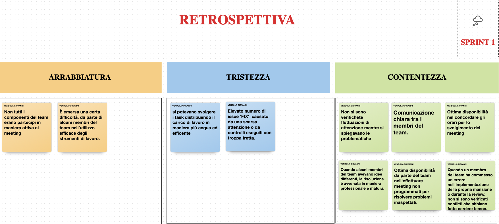

  Dalla tabella si evince che:
<ul>
    <li>Il team è contento di:
        <ul>
            <li>Non si sono verificate fluttuazioni di attenzione mentre si spiegavano le problematiche</li>
            <li>Comunicazione chiara tra i membri del team</li>
            <li>Ottima disponibilità nel concordare gli orari per lo svolgimento dei meeting</li>
            <li>Quando alcuni membri del team avevano idee differenti, la risoluzione è avvenuta in maniera professionale e matura</li>
            <li>Ottima disponibilità da parte del team nell'effettuare meeting non programmati per risolvere problemi inaspettati</li>
            <li>Quando un membro del team ha commesso un errore nell'implementazione della propria mansione o durante le review, non si sono verificati conflitti che abbiano fatto perdere tempo</li>
        </ul>
    </li>
    <li>Il team è triste per:
        <ul>
            <li>Si potevano svolgere i task distribuendo il carico di lavoro in maniera più equa ed efficente</li>
            <li></li>
</ul>
    </li>
    <li>Il team è arrabbiato per:
        <ul>
            <li>Non tutti i componenti del team erano partecipi in maniera attiva si meeting</li>
            <li>È emersa una certa difficoltà, da parte di alcuni membri del team nell'utilizzo efficace degli strumenti di lavoro</li>
        </ul>
    </li>
</ul>

## Miglioramenti proposti

Dopo aver analizzato i punti riportati nella tabella, il team ha deciso di:
•⁠  ⁠Si è deciso di porre delle domande ai membri del team che non parteciapano in modo attivo , per assicurarsi della loro comprensione. 
•⁠  ⁠Formaione interna su strumenti di lavoro(es brevi sessioni di tutoring o guide rapide condivise)
•⁠  ⁠Pianificazione più bilanciate dei task, assegando meno issue per chi riceve issue più complesse. 
•⁠  ⁠Revisioni più accurate per evitare *ISSUE FIX*

## Conclusioni
Il team conviene nel dire che il lavoro è stato svolto in maniera corretta ma che ci sia sempre un margine di miglioramento,
infatti, per esempio, sicuramente programmando prima dell'esecuzione e parallelizzando di più il lavoro si può svolgere il tutto in maniera molto più efficiente.

#### [Ritorna all'Indice](#indice) 👻
